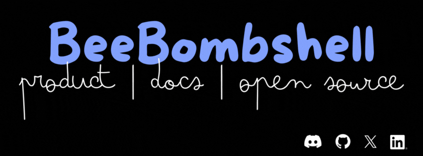
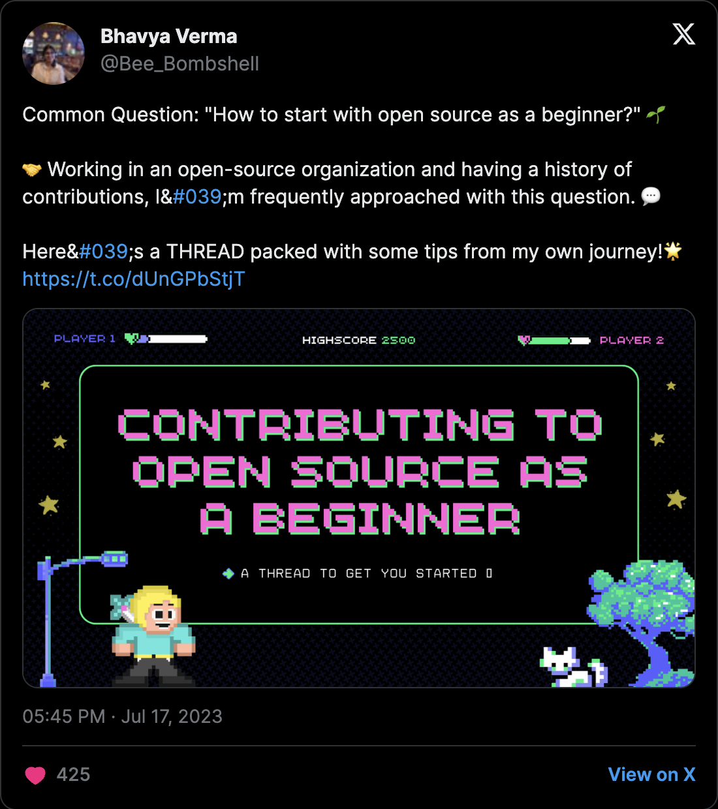
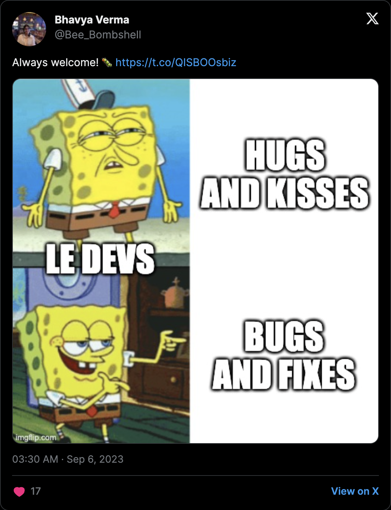
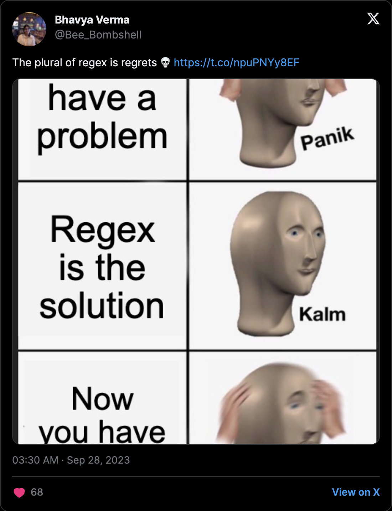

Hey, I’m Bhavya 👋  
Product Engineer • Shipping Features & Memes in equal measure

I like coming up with ideas, building them, breaking them, and laughing about it *after* they work. No cap! 😂

I 💜 living at the intersection of **Product, Engineering, and Community**. Most days, I’m either:
- writing code
- writing *about* code
- or staring at my screen pretending I’m thinking (I am)

I’ve been building and shipping for **3+ years** at [BuildShip](https://buildship.com) and [Rowy](https://www.rowy.io), and contributing to open source like **UNICEF Innovation, Apache APISIX, and Fedora**, because good software should actually be for everyone! :D

  

---

### Vibe with Me ⬇️

  

> Like this widget? Steal it 👀  
> Check out the [Spotify Now Playing](https://spotify.beebombshell.com/) repo and add it to your own profile.

You’ll usually find me posting relatable dev memes, hyping people up, or chasing side-project ideas at unreasonable hours.

---

### What I Work With 🛠️

#### 🌐 Languages & Frontend
 
 
 
 
 
 

#### ⚙️ Backend & Infrastructure
 
 
 
 
 
 

#### 🛠️ Tools & Cloud
 
 
 

### Highlights from X 🐦

### You Made it to the End 🎉

Here's to more shipping, more side-projects, and breaking things slightly less than before.

Let's connect:

🐦 [Twitter/X](https://x.com/Bee_Bombshell) • 📝 [Blog/Writing](https://www.beebombshell.com) • 💼 [LinkedIn](https://www.linkedin.com/in/beebombshell)

